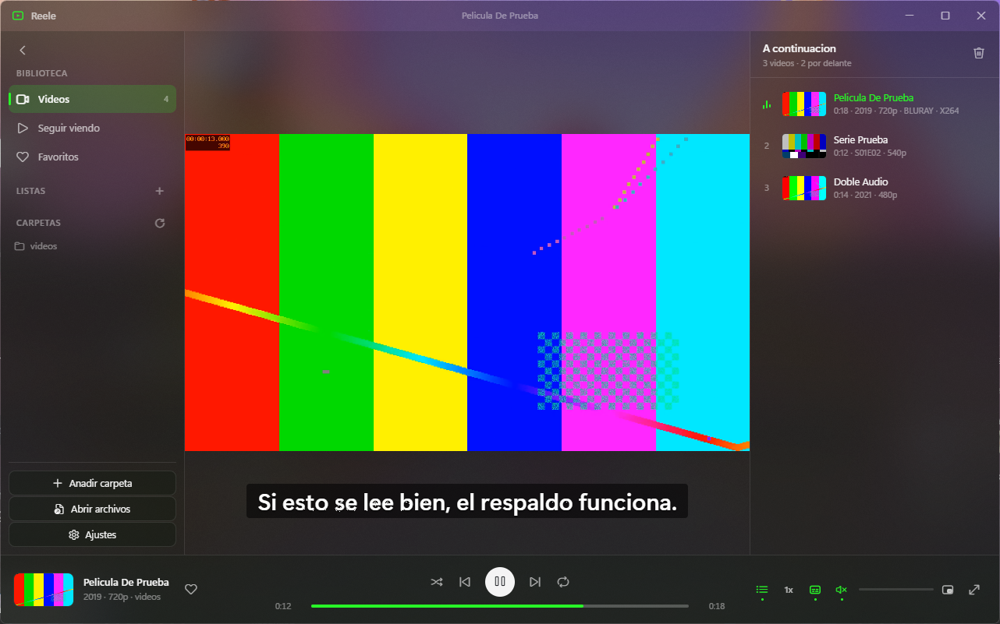

# Reele

Reproductor de vídeo de escritorio para Windows 11, con el acrílico real de
DWM: una película 2.39:1 flotando sobre el escritorio difuminado en vez de
dentro de un rectángulo negro.

Es el hermano de [Sounde](https://github.com/watskybelfort/Sounde) — mismo
tema, misma estructura, mismos hábitos — pero pensado de arriba abajo para
vídeo: subtítulos, pistas de audio, continuar donde lo dejaste y la pantalla
que no se apaga.



---

## Qué hace

**Biblioteca.** Añades carpetas y aparecen todos los vídeos al instante. El
escaneo no abre los archivos: se queda en lo que da el sistema de archivos,
así que una colección de miles de películas se lista en milisegundos. La
duración y el fotograma de portada los rellena después el renderer en segundo
plano, uno a uno, sin bloquear nada.

**Títulos legibles.** Un vídeo no trae etiquetas como un MP3, así que el
título sale del nombre del archivo. `Nombre.De.La.Pelicula.2019.1080p.BluRay
.x265-GRUPO.mkv` se lee como **Nombre De La Pelicula · 2019 · 1080p · BLURAY**,
y `Rick.and.Morty.S07E01.WEBRip.x264-ION10` como **Rick and Morty · S07E01**.
Lo que se descarta no se tira: se guarda como etiqueta, porque saber si una
copia es 4K o 1080p es justo lo que se mira cuando hay dos del mismo vídeo.

**Subtítulos.** Encuentra los `.srt`, `.vtt`, `.ass` y `.ssa` que acompañan al
vídeo —al lado, en `Subs/` o en una carpeta con su nombre—, deduce el idioma
del sufijo y enciende solo el preferido. Se pintan a mano en vez de con el
`<track>` del navegador, lo que permite retardo ajustable en caliente, tamaño
de letra propio y que suban cuando aparecen los mandos.

**Pistas de audio.** Cuando un MKV trae castellano e inglés, se cambia de una
a otra desde la barra.

**Continuar donde lo dejaste.** Guarda la posición de cada vídeo y arranca
ahí, con un aviso discreto arriba a la derecha por si querías empezar de cero.
Lo que dejaste a medias tiene su propia vista en el lateral, con la barrita de
lo visto sobre cada miniatura.

**Y lo de siempre.** Cola de reproducción, favoritos, listas, búsqueda,
aleatorio y repetición, mini reproductor flotante 16:9, pantalla completa,
velocidad de 0,25x a 3x, teclado completo, teclas multimedia, botones en la
miniatura de la barra de tareas, bandeja, y el color del vidrio sacado del
fotograma de lo que estés viendo.

---

## Lo que no puede reproducir

Reele usa el decodificador de Chromium, no ffmpeg. Conviene saber dónde está
el límite antes de encontrárselo:

| | |
|---|---|
| **Vídeo que va** | H.264, VP8, VP9, AV1 |
| **Vídeo que depende** | HEVC/H.265 solo si la máquina lo decodifica por hardware |
| **Vídeo que no va** | VC-1, MPEG-2, y cualquier cosa en AVI, WMV, FLV o MPG |
| **Audio que va** | AAC, MP3, Opus, Vorbis, FLAC |
| **Audio que no va** | AC3, E-AC3, DTS, TrueHD |

Un archivo con vídeo compatible y audio AC3 **se ve pero no suena**. Es el
caso raro que más despista, así que la aplicación lo dice en Ajustes en vez de
dejarte pensando que está rota.

Por eso la lista de extensiones deja fuera a propósito `.avi`, `.wmv`, `.flv`
y `.mpg`: anunciarlas solo serviría para verlas en la biblioteca y que luego
dieran pantalla negra.

---

## Atajos

| Tecla | Qué hace |
|---|---|
| `Espacio` · `K` | Reproducir o pausar |
| `←` `→` · `J` `L` | 10 segundos atrás o adelante |
| `Shift` + `←` `→` | 60 segundos |
| `0`–`9` | Saltar a ese décimo del vídeo |
| `↑` `↓` | Volumen |
| `M` | Silenciar |
| `F` · `F11` · doble clic | Pantalla completa |
| `Escape` | Sale de pantalla completa, luego vuelve a la biblioteca |
| `Ctrl` + `M` | Mini reproductor |
| `N` · `P` | Siguiente o anterior de la cola |
| `C` | Poner o quitar los subtítulos |
| `G` · `H` | Adelantar o atrasar los subtítulos 250 ms |
| `+` `-` | Más rápido o más lento |
| `E` | Cambiar el encaje de la imagen |
| `Ctrl` + `F` | Buscar en la biblioteca |
| `Ctrl` + `O` | Abrir archivos |
| `Ctrl` + `,` | Ajustes |

La rueda del ratón sobre la imagen cambia el volumen.

---

## Cómo está hecho

Electron, sin dependencias de tiempo de ejecución. Todo lo que hace falta —el
contenedor del icono, el análisis de nombres, los tres parsers de subtítulos,
la extracción de color, la lista virtualizada— está escrito en el repositorio.

### El vidrio

El desenfoque del escritorio **no** lo hace el CSS. `backdrop-filter` solo
puede muestrear píxeles que ya están dentro de la página; lo que difumina el
escritorio es DWM, detrás de la ventana entera, y el CSS se limita a no pintar
opaco. De ahí las tres reglas que sostienen el tema:

- la ventana es opaca "para Electron" y lleva el color de fondo con alfa 0,
- `html` y `body` nunca pintan un fondo sólido,
- solo se tintan las superficies que no se solapan entre sí, o las veladuras
  se suman y el resultado tira a gris.

`styles/acrylic.css` tiene tres perillas —transparencia, tinte y acento— y
todo lo demás se deriva de ellas.

### El reparto entre procesos

| | |
|---|---|
| **Principal** | Índice de la biblioteca, subtítulos, favoritos, posiciones, ventana, bandeja, barra de tareas |
| **Renderer** | Todo lo que necesite decodificar vídeo: reproducción, duraciones, miniaturas y color dominante |

Esa frontera explica la decisión más grande del proyecto: el escaneo no abre
los archivos. Para saber cuánto dura un MKV hay que demultiplexarlo, y hacerlo
en el proceso principal significaría arrastrar ffmpeg entero. En el renderer
ya hay un decodificador, así que es él quien abre cada vídeo en segundo plano
y devuelve duración, tamaño y un fotograma.

### Los tres esquemas propios

`reele://app` para la interfaz (sobre `file://` Chromium bloquea los módulos
ES), `reele-file://local` para los archivos del disco —con soporte de rangos,
sin el cual saltar en una película de 4 GB la descargaría entera primero— y
`reele-thumb://cache` para los fotogramas. Ninguno sirve nada que no esté bajo
una carpeta autorizada.

---

## Desarrollo

```powershell
npm ci
npm start        # abre la aplicación
npm run dev      # además, herramientas de desarrollo y consola en el terminal
npm run icono    # redibuja build/icon.ico desde el código
npm run dist     # instalador NSIS en dist/
```

Ver [INSTALAR.md](INSTALAR.md) para instalarlo y ponerlo como reproductor
predeterminado.

---

## Licencia

MIT. Ver [LICENSE](LICENSE).
